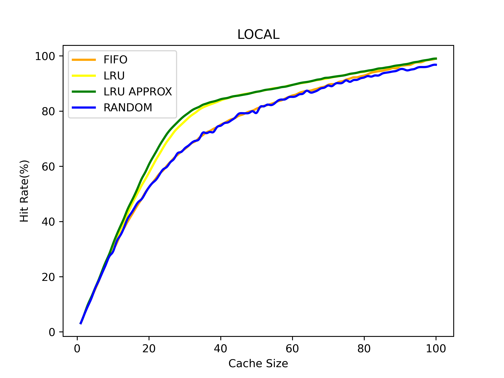
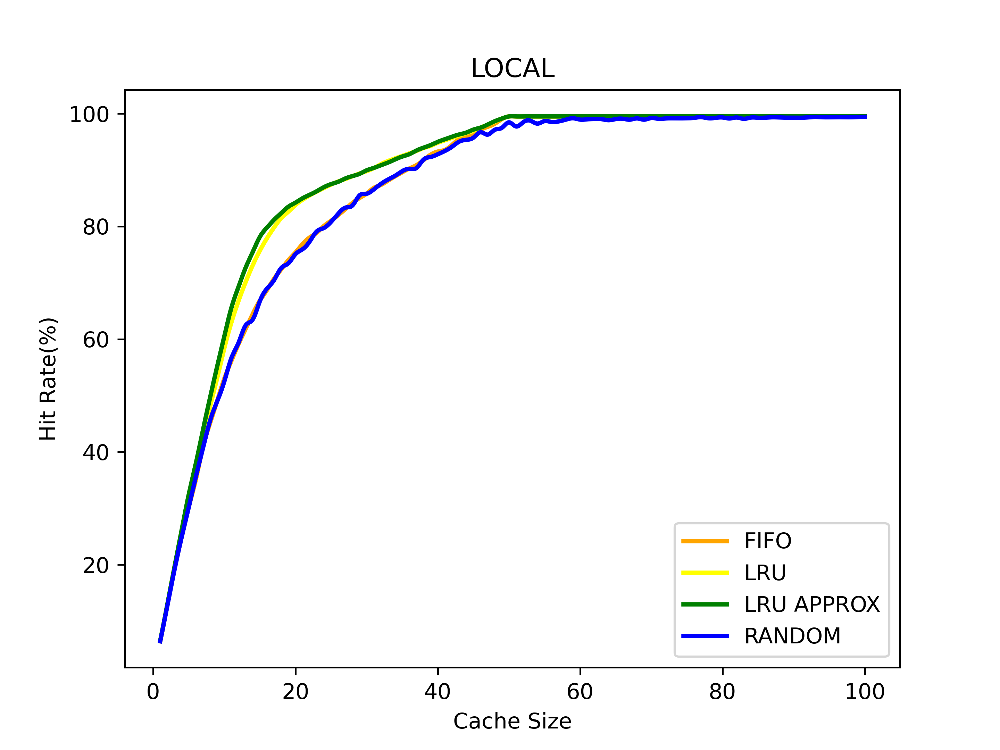
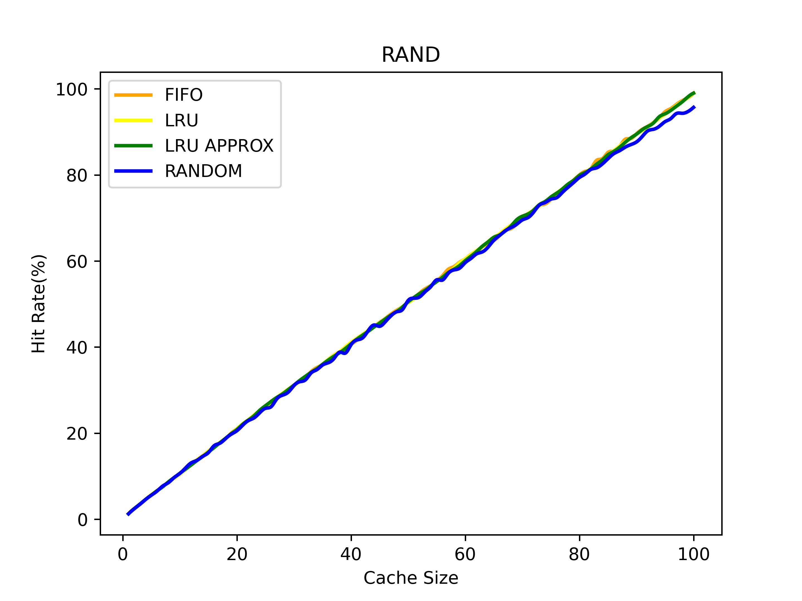
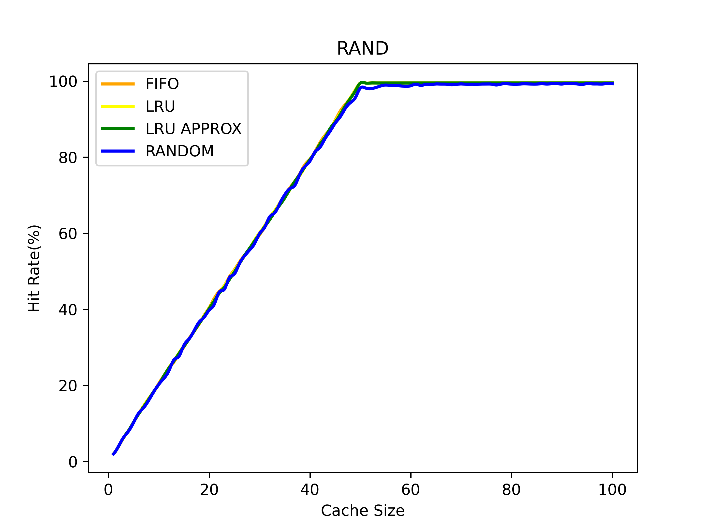
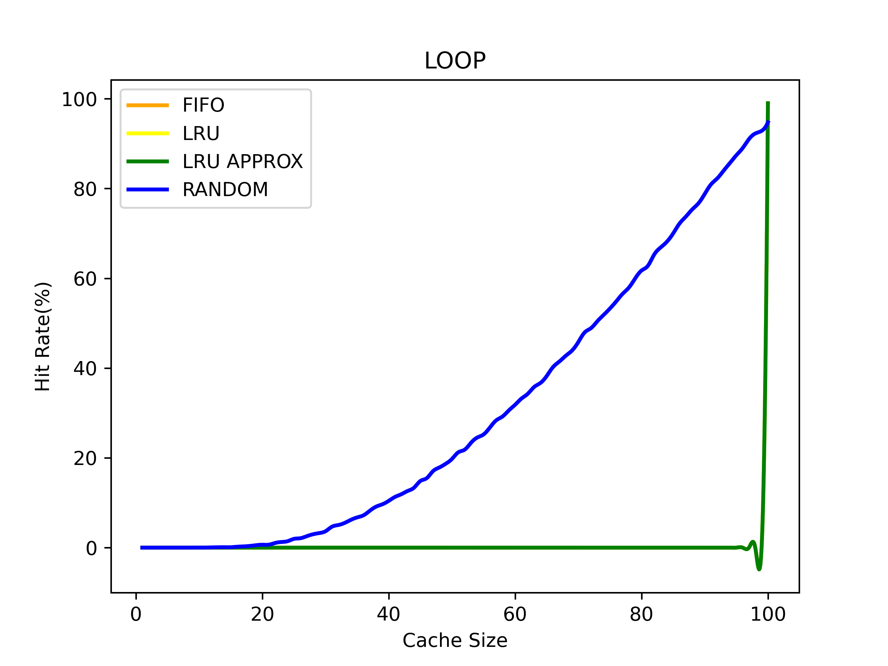
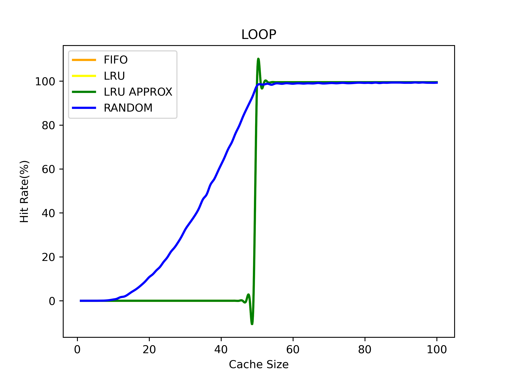

## Cache Policies ⭐

Implementation of various page replacement policies including First in First out (FIFO), Least Recently Used (LRU), Approximate LRU and Random on Looping, No Locality and 80-20 workloads. 

### Directory Structure 📁

```
page_replacement_policies
├─ checker.c
├─ CSV
│  ├─ FIFO_LOCAL.csv
│  ├─ FIFO_LOOP.csv
│  ├─ FIFO_RAND.csv
│  ├─ LRU_APPROX_LOCAL.csv
│  ├─ LRU_APPROX_LOOP.csv
│  ├─ LRU_APPROX_RAND.csv
│  ├─ LRU_LOCAL.csv
│  ├─ LRU_LOOP.csv
│  ├─ LRU_RAND.csv
│  ├─ RANDOM_LOCAL.csv
│  ├─ RANDOM_LOOP.csv
│  └─ RANDOM_RAND.csv
├─ definitions.h
├─ generate.c
├─ main.c
├─ Makefile
├─ plot.py
├─ plots
│  ├─ LOCAL_100_Unique.png
│  ├─ LOCAL_50_Unique.png
│  ├─ LOOP_100_Unique.png
│  ├─ LOOP_50_Unique.png
│  ├─ RAND_100_Unique.png
│  └─ RAND_50_Unique.png
├─ policy.c
├─ README.md
└─ workload.c

```

### Feature Checklist ✅

```
✅ Least Recently Used(LRU)
✅ Approximate Least Recently Used (Clock-Hand Algorithm)
✅ First-In-First-Out(FIFO)
✅ Random
```

### Instructions to Run 🏃

    - Run `make` to build, execute and generate plots.
    - Run `make check` to run the checker test file
    - Run `make clean` to remove the build files 

### Results and Conclusions 📰

* Workload of size 10000 pages
* Cache Size of 100

* 80-20

    Unique Pages = 100            |  Unique Pages = 50
    :-------------------------:|:-------------------------:
      |  
   

* Random

    Unique Pages = 100            |  Unique Pages = 50
    :-------------------------:|:-------------------------:
      |  

* Looping

    Unique Pages = 100            |  Unique Pages = 50
    :-------------------------:|:-------------------------:
      |  


### Complexity Analysis

### FIFO Policy

* Using array for maintaining cache
* Space Complexity: O(cache_size)
* Time Complexity: O(cache_size*size)

### LRU Policy

* Using array for maintaining cache and last accessed time
* Space Complexity: O(cache_size)
* Time Complexity: O(cache_size*size)

### LRU Approx Policy

* Using array for maintaining cache and bit references
* Space Complexity: O(cache_size)
* Time Complexity: O(cache_size*size)

### Random Policy

* Using array for maintaining cache
* Space Complexity: O(cache_size)
* Time Complexity: O(cache_size*size)
