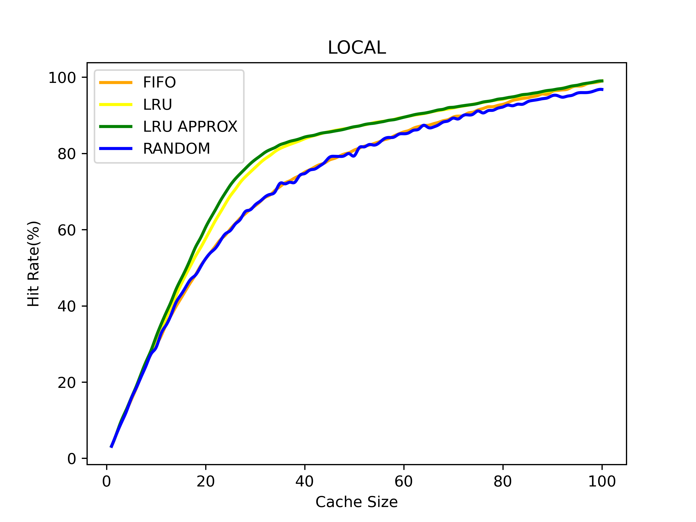
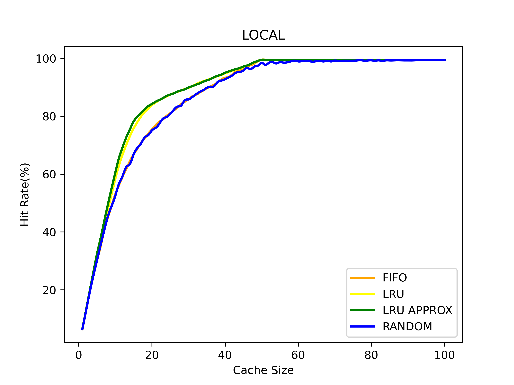
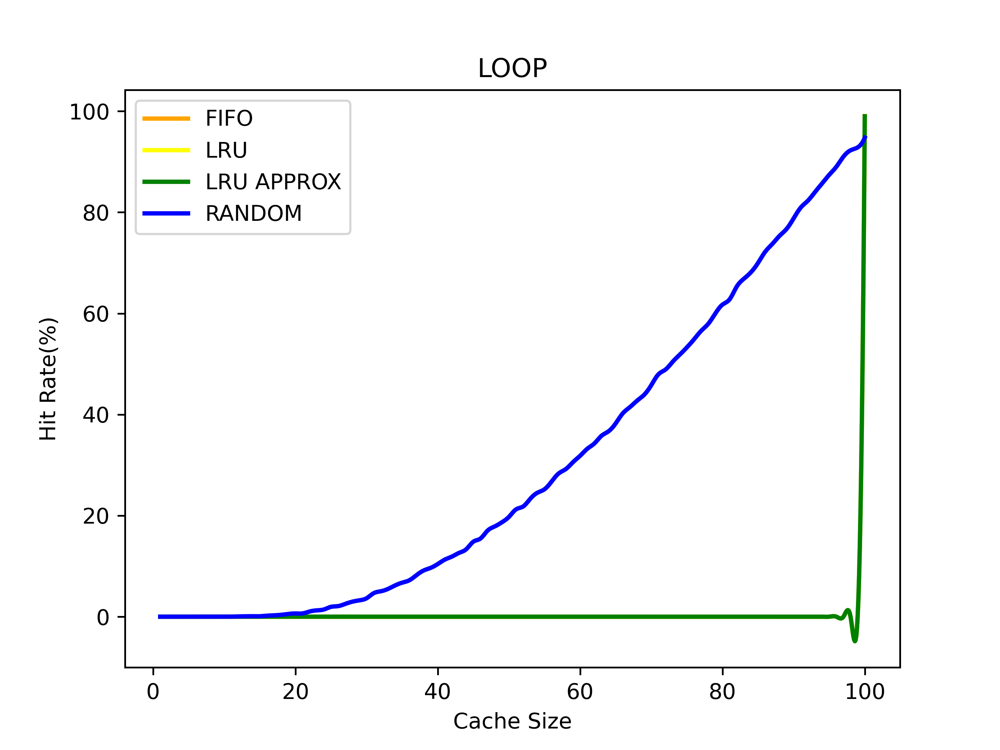
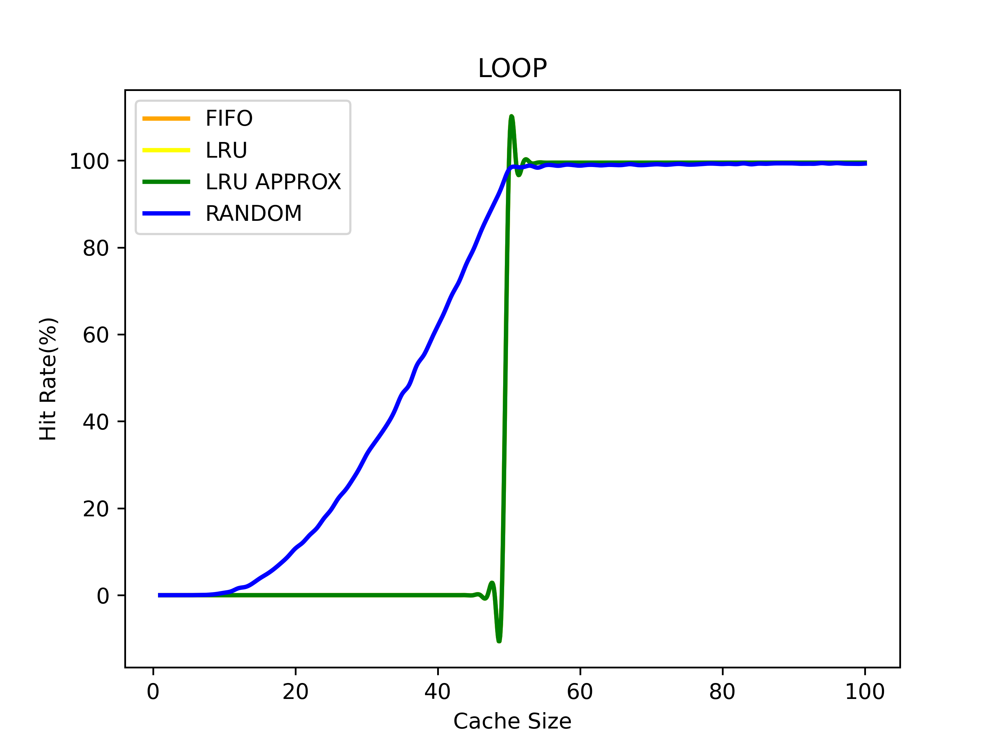
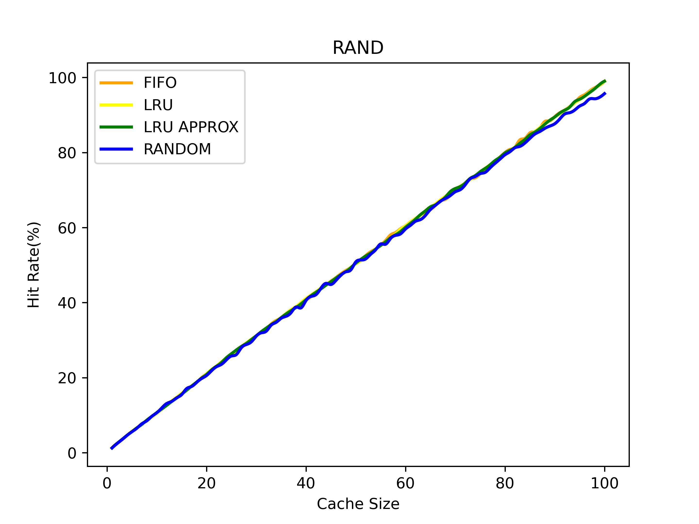
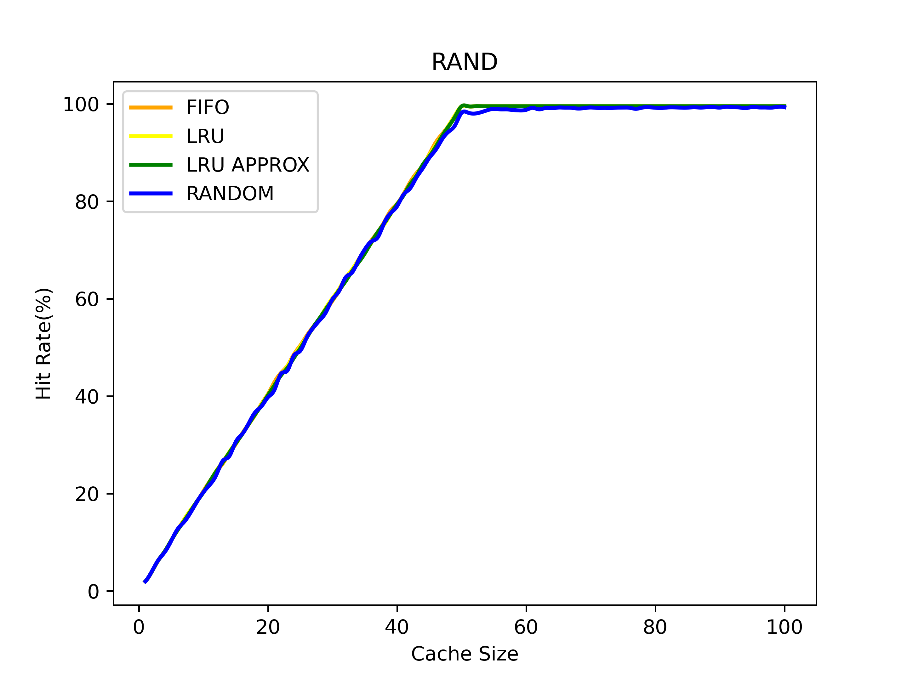

## Plots

* Workload of size 10000 pages
* Cache Size of 100

### Local Workload

* Plot for 100 Unique pages

* Plot for 50 Unique pages

### Loop Workload

* Plot for 100 Unique pages

* Plot for 50 Unique pages

### Random Workload

* Plot for 100 Unique pages

* Plot for 50 Unique pages

## Complexity Analysis

### FIFO Policy

* Using array for maintaining cache
* Space Complexity: O(cache_size)
* Time Complexity: O(cache_size*size)

### LRU Policy

* Using array for maintaining cache and last accessed time
* Space Complexity: 2*O(cache_size)
* Time Complexity: O(cache_size*size)

### LRU Approx Policy

* Using array for maintaining cache and bit references
* Space Complexity: 2*O(cache_size)
* Time Complexity: O(cache_size*size)

### Random Policy

* Using array for maintaining cache
* Space Complexity: O(cache_size)
* Time Complexity: O(cache_size*size)